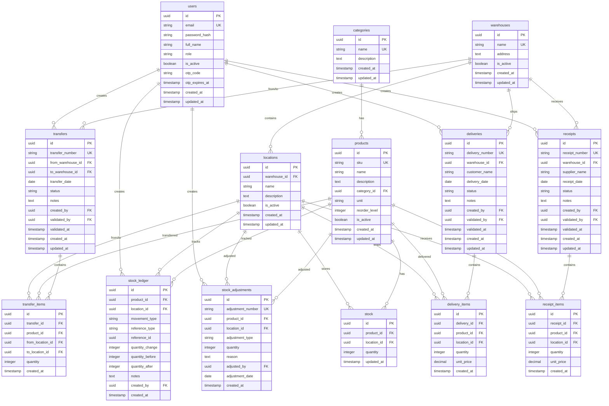

# StockMaster Database ER Diagram

## Key Relationships

1. **Users** can create receipts, deliveries, transfers, and adjustments
2. **Products** belong to categories and have stock at multiple locations
3. **Warehouses** contain multiple locations
4. **Locations** store stock for products
5. **Receipts** increase stock when validated
6. **Deliveries** decrease stock when validated
7. **Transfers** move stock between locations
8. **Adjustments** correct stock levels
9. **Stock Ledger** maintains an audit trail of all movements

